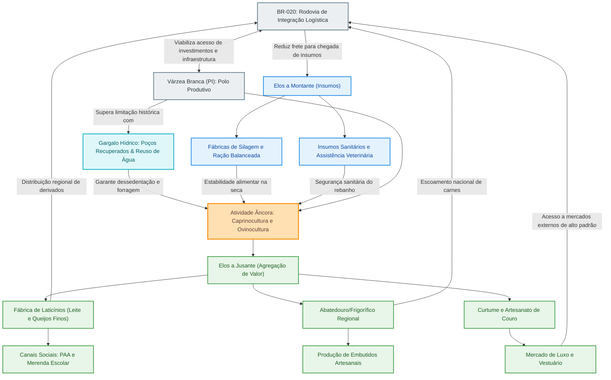

```mermaid
flowchart TD
    %% =======================================================
    %% DEFINIÇÕES DE NÓS (camelCase no início do código)
    %% =======================================================
    br020["BR-020: Rodovia de Integração Logística"]
    varzeaBranca["Várzea Branca (PI): Polo Produtivo"]
    desafioHidrico["Gargalo Hídrico: Poços Recuperados & Reuso de Água"]
    
    %% Âncora (Laranja/Âmbar)
    caprinovinocultura["Atividade Âncora: Caprinocultura e Ovinocultura"]
    
    %% Montante (Azul)
    montante["Elos a Montante (Insumos)"]
    silagemRacao["Fábricas de Silagem e Ração Balanceada"]
    insumosSanitarios["Insumos Sanitários e Assistência Veterinária"]
    
    %% Jusante (Verde)
    jusante["Elos a Jusante (Agregação de Valor)"]
    laticinioCabra["Fábrica de Laticínios (Leite e Queijos Finos)"]
    programasSociais["Canais Sociais: PAA e Merenda Escolar"]
    abatedouroFrigorifico["Abatedouro/Frigorífico Regional"]
    embutidosLocais["Produção de Embutidos Artesanais"]
    industriaPeleCouro["Curtume e Artesanato de Couro"]
    industriasLuxo["Mercado de Luxo e Vestuário"]

    %% =======================================================
    %% CONEXÕES E RELACIONAMENTOS (Fluxos da Cadeia)
    %% =======================================================
    
    %% Conexão Direta entre BR-020 e o Município
    br020 <-->|"Viabiliza acesso de investimentos e infraestrutura"| varzeaBranca
    
    %% Desafio Hídrico como Condição Vigente de Suporte
    varzeaBranca -->|"Supera limitação histórica com"| desafioHidrico
    desafioHidrico -->|"Garante dessedentação e forragem"| caprinovinocultura
    
    %% Relacionamento com Montante (Insumos)
    br020 -->|"Reduz frete para chegada de insumos"| montante
    montante --> silagemRacao
    montante --> insumosSanitarios
    silagemRacao -->|"Estabilidade alimentar na seca"| caprinovinocultura
    insumosSanitarios -->|"Segurança sanitária do rebanho"| caprinovinocultura

    %% Relacionamento com a Âncora
    varzeaBranca --> caprinovinocultura
    caprinovinocultura --> jusante

    %% Relacionamento com Jusante (Saída) e Escoamento via BR-020
    jusante --> laticinioCabra
    jusante --> abatedouroFrigorifico
    jusante --> industriaPeleCouro
    
    laticinioCabra --> programasSociais
    abatedouroFrigorifico --> embutidosLocais
    industriaPeleCouro --> industriasLuxo
    
    laticinioCabra -->|"Distribuição regional de derivados"| br020
    abatedouroFrigorifico -->|"Escoamento nacional de carnes"| br020
    industriasLuxo -->|"Acesso a mercados externos de alto padrão"| br020

    %% =======================================================
    %% ESTILIZAÇÃO E CORES (Classes CSS para Legenda)
    %% =======================================================
    classDef logistica fill:#eceff1,stroke:#607d8b,stroke-width:2px,color:#263238;
    classDef hidrico fill:#e0f7fa,stroke:#00acc1,stroke-width:2px,color:#006064;
    classDef ancora fill:#ffe0b2,stroke:#fb8c00,stroke-width:2.5px,color:#5d4037;
    classDef montante fill:#e3f2fd,stroke:#1e88e5,stroke-width:2px,color:#0d47a1;
    classDef jusante fill:#e8f5e9,stroke:#43a047,stroke-width:2px,color:#1b5e20;

    class br020,varzeaBranca logistica;
    class desafioHidrico hidrico;
    class caprinovinocultura ancora;
    class montante,silagemRacao,insumosSanitarios montante;
    class jusante,laticinioCabra,programasSociais,abatedouroFrigorifico,embutidosLocais,industriaPeleCouro,industriasLuxo jusante;
```